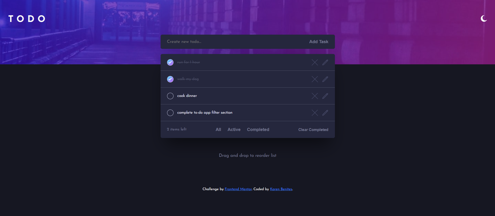

# Frontend Mentor - Todo app solution

This is a solution to the [Todo app challenge on Frontend Mentor](https://www.frontendmentor.io/challenges/todo-app-Su1_KokOW).

## Table of contents

- [Overview](#overview)
  - [The challenge](#the-challenge)
  - [Screenshot](#screenshot)
  - [Links](#links)
- [My process](#my-process)
  - [Built with](#built-with)
  - [What I learned](#what-i-learned)
  - [Continued development](#continued-development)
  - [Useful resources](#useful-resources)
- [Author](#author)
- [Acknowledgments](#acknowledgments)

## Overview

### The challenge

Users should be able to:

- View the optimal layout for the app depending on their device's screen size
- See hover states for all interactive elements on the page (still building..)
- Add new todos to the list
- Mark todos as complete
- Delete todos from the list
- Filter by all/active/complete todos (still building..)
- Clear all completed todos
- Toggle light and dark mode
- **Bonus**: Drag and drop to reorder items on the list (still building..)

### Screenshot




### Links

<!-- - Solution URL: [Add solution URL here](https://your-solution-url.com) -->

- Live Site URL: [live site URL here](https://karen-benites.github.io/todo-app-main/)

## My process

### Built with

- Semantic HTML5 markup
- CSS custom properties
- Flexbox
- Mobile-first workflow
- Vanilla Javascript

### What I learned

This is my first time manipulating DOM, so I really learnt a lot here. I've learned not only to manage click events, but also screen size changing events. I also reflected on functions building, realizing when to enclose a piece of code into a function, in order to re-use it in other parts of the script.

Regarding styling, I've learnt how to use CSS classes and specificity to implement dark theme without adding unecessary CSS code. 

This was also my first time managing form data directlu from HTML.

```html: form structure
<form id="task__form">
      <input type="text" id="task__input" placeholder="Create new todo..." required>
      <button type="submit" class="submit__button", aria-label="submit your task">Add Task</button>
</form>
```

```css: an example of implementing dark theme styles with existing css classes.
.dark-theme .task__dashboard, .dark-theme .task__summary{
    box-shadow: 0px 35px 50px -15px rgba(0, 0, 0, 0.50);
}
```

```js: A single function example used in many other functions and event listeners
function createElementWithClass(type, className, textContent = "") {
    const element = document.createElement(type);
    element.className = className;
    if (textContent) element.textContent = textContent;
    return element;
}

function completedTasksCollector(){
    const taskChildrenArray = [...taskList.children]
    const completedTasksArray = taskChildrenArray.filter((liElement)=>{
        const button = liElement.querySelector(".check-btn")
        return button.classList.contains("task__checked-btn")
    })
    return completedTasksArray
}
```

### Continued development

I'd like to implement check tasks functionality using HTML checkboxes. Now I'm using regular buttons and event listeners to change button styles, but later I realized I've could have done the same thing using more semantic HTML. Checkboxes are the perfect tag to CHECK completed tasks.

Also, I'm also incorporating drag and drop functionality along with the filter section.

### Useful resources

- [Platzi DOM course](https://platzi.com/cursos/document-object-model/) - This helped me for understanding and practicing DOM manipulation.
- [Moredev Intermediate course](https://github.com/mouredev/hello-javascript) - This repository consists of a series of live classes regarding beginner and intermediate javascript concepts for all purposes. It helped me getting the basis of the language and go further with POO and advanced functions.

## Author

- Linkedin - [Linkedin profile](https://www.linkedin.com/in/karenlbenites/)
- Frontend Mentor - [@yourusername](https://www.frontendmentor.io/profile/Karen-Benites)