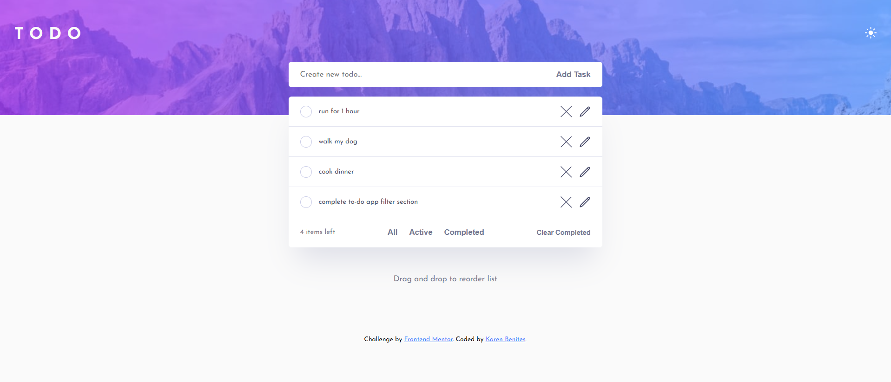

# Frontend Mentor - Todo app solution

This is a solution to the [Todo app challenge on Frontend Mentor](https://www.frontendmentor.io/challenges/todo-app-Su1_KokOW).

## Table of contents

- [Overview](#overview)
  - [The challenge](#the-challenge)
  - [Screenshot](#screenshot)
  - [Links](#links)
- [My process](#my-process)
  - [Built with](#built-with)
  - [What I learned](#what-i-learned)
  - [Continued development](#continued-development)
  - [Useful resources](#useful-resources)
- [Author](#author)

## Overview

### The challenge

Users should be able to:

- View the optimal layout for the app depending on their device's screen size
- See hover states for all interactive elements on the page
- Add new todos to the list
- Mark todos as complete
- Delete todos from the list
- Filter by all/active/complete todos
- Clear all completed todos
- Toggle light and dark mode
- **Bonus**: Drag and drop to reorder items on the list (still building..)

### Screenshot




### Links

<!-- - Solution URL: [Add solution URL here](https://your-solution-url.com) -->

- Live Site URL: [live site URL here](https://karen-benites.github.io/todo-app-main/)

## My process

### Built with

- Semantic HTML5 markup
- CSS custom properties
- Flexbox
- Mobile-first workflow
- Vanilla Javascript

### What I learned

This is my first time manipulating DOM, so I really learnt a lot here. I've learned not only to manage click events, but also screen size changing events. I also reflected on functions building, realizing when to enclose a piece of code into a function, in order to re-use it in other parts of the script.

Regarding styling, I've learnt how to use CSS classes and specificity to implement dark theme without adding unecessary CSS code.

This was also my first time managing form data directly from HTML.

css: an example of implementing dark theme styles with existing css classes.

```css
.dark-theme .task__dashboard, .dark-theme .task__summary{
    box-shadow: 0px 35px 50px -15px rgba(0, 0, 0, 0.50);
}
```

js: How I refactored a function with lots of duplicated code.

It went from this:

```js
function filterTasks(filter){
    const tasksList = JSON.parse(localStorage.getItem("tasks")) || []
    const completedTasks = tasksList.filter(task => task.isCompleted === true)
    const activeTasks = tasksList.filter(task => task.isCompleted === false)
    switch(filter){
      case "all":
        tasksList.forEach((task) => {
          const ID = task.id
          const taskElement = document.getElementById(`${ID}`)
          const taskLiParent = taskElement.closest("li")
          taskLiParent.classList.remove("hidden")
        });

        break
      case "completed":
        activeTasks.forEach(task=>{
          const ID = task.id
          const taskElement = document.getElementById(`${ID}`)
          const taskLiParent = taskElement.closest("li")
          taskLiParent.classList.add("hidden")
        })
        completedTasks.forEach(task =>{
          const ID = task.id
          const taskElement = document.getElementById(`${ID}`)
          const taskLiParent = taskElement.closest("li")
          taskLiParent.classList.remove("hidden")
        })
        break
      case "active":
        completedTasks.forEach(task =>{
          const ID = task.id
          const taskElement = document.getElementById(`${ID}`)
          const taskLiParent = taskElement.closest("li")
          taskLiParent.classList.add("hidden")
        })
        activeTasks.forEach(task=>{
          const ID = task.id
          const taskElement = document.getElementById(`${ID}`)
          const taskLiParent = taskElement.closest("li")
          taskLiParent.classList.remove("hidden")
        })
        break
    }
}
```

to this:

```js
function filterTasks(filter) {
  const tasksList = getTasksList("all")
  const completedTasks = getTasksList("completed")
  const activeTasks = getTasksList("active")

  function processTasksList(targetTasksList, action) {
    targetTasksList.forEach(task => {
      const [, , taskLiParent] = getTaskData(task)
      if (action === "remove") {
        taskLiParent.classList.remove("hidden")
      } else if (action === "add") {
        taskLiParent.classList.add("hidden")
      }
    })
  }

  switch (filter) {
    case "all":
      processTasksList(tasksList, "remove")
      break
    case "completed":
      processTasksList(activeTasks, "add")
      processTasksList(completedTasks, "remove")
      break
    case "active":
      processTasksList(completedTasks, "add")
      processTasksList(activeTasks, "remove")
      break
  }
}
```

### Continued development

I'm working on incorporating drag and drop functionality. Also, I'm figuring out how to disable some sticky hover states on touch devices that can complicate user experience when interacting with the checkbox. I've already applied some suggestions that work fine on Chrome mobile simulation on my laptop, but fail on my actual smartphone chrome browser.

### Useful resources

- [Platzi DOM course](https://platzi.com/cursos/document-object-model/) - This helped me for understanding and practicing DOM manipulation.
- [Moredev Intermediate JS course](https://github.com/mouredev/hello-javascript) - This repository consists of a series of live classes regarding beginner and intermediate javascript concepts for all purposes. It helped me getting the basis of the language and go further with POO and advanced functions.

## Author

- Linkedin - [Karen Benites](https://www.linkedin.com/in/karenlbenites/)
- Frontend Mentor - [@Karen-Benites](https://www.frontendmentor.io/profile/Karen-Benites)
